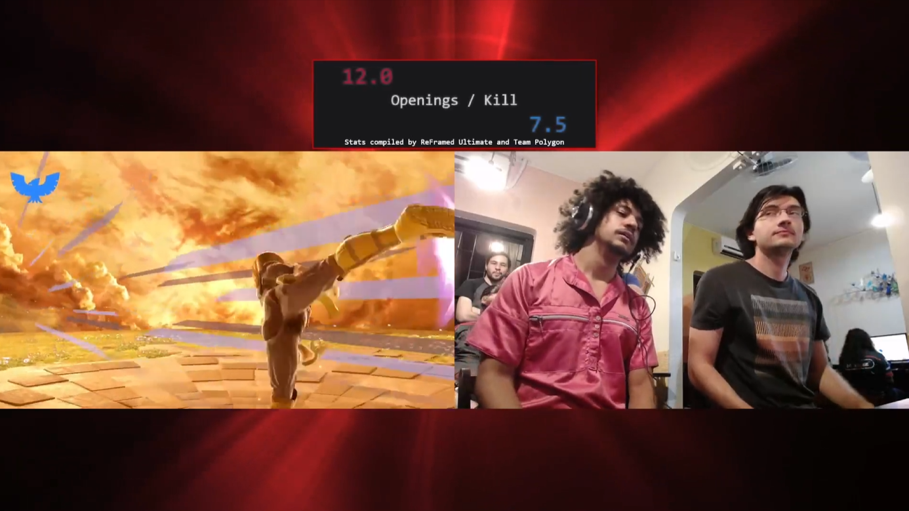

## What is it?
A compact widget for use with ReFramed that cycles between the stats generated by a game or set through an animation. 

## Installation and Usage
1. Download this project by clicking on "Code" and then "Download ZIP"
2. Unzip the contents to any directory of choice.
3. Make a copy of the `config-example.js` file, name it `config.js`, and open it in any text editor.
4. Change all of the variables as you see fit (you may want to include/exclude stats, URL should stay the default if you are running the stream in the same machine that runs ReFramed)
5. Create a Browser Source in OBS, and add `index.html` as the file.
6. If you know your way around CSS, feel free to edit the `style.css` file to change the background color, border, text font/size, anything you like.